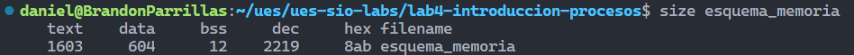

Laboratorio4<a name="TOP"></a>
===================
# Introducción a procesos

## Esquema de memoria de un programa en lenguaje C

Debemos tener instalado los paquetes build-essential y libc6-dev, para instalarlo ejecutamos la siguiente instrucción en consola:
```bash
sudo apt install build-essential libc6-dev
```
Y para compilarlo usaremos la siguiente instrucción:
```bash
gcc -o esquema_memoria esquema_memoria.c
```

Y se ejecuta de la siguiente forma:
```bash
./esquema_memoria
```

Podemos utilizar el comando size para ver cuánta memoria utilizará (en bytes)
```bash
size esquema_memoria
```

_Image with alt :_



> `data`  se refiere a los datos no inicializados <br/>
> `bss`  a los datos inicializados<br/>
> `dec` y `hex` se refieren a la suma de los campos
anteriores, representados en decimal y hexadecimal respectivamente

